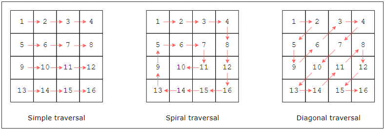

# Matricies

A matric is a group of numbers arranged in rows and columns in a rectangular pattern.

Most problems requiring matrixes can be solved using the follow:
- **Matrix Transformations** - scaling, translation, rotation and reflection
- **Matrix Traversal** - simple, spiral and diagnol

### We use matrixes when we need to:
- Process digital images (each element of matrix reqpresents pixel)
- Represent a graph as an adjancency matrix where each row repressents a vertex and each column represents edge
- Store results of the subproblems calcullated while solving using dynamic programming
- Solve different math equations
- Implement grid game (chess, candy crush, sudoku, snake, tic-tac-toe)

## Does my problem match this pattern?

Yes if:
- Input data is given as a 2D array

No if:
- Input data is not 2D array
- Input data is given as 2D array, but falls  under some other pattern that can't be solved by matrix (ex. graphs and dynamic programming)

