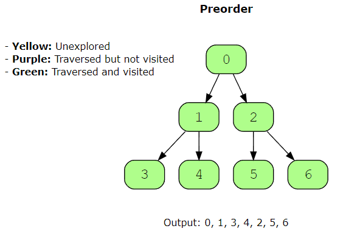
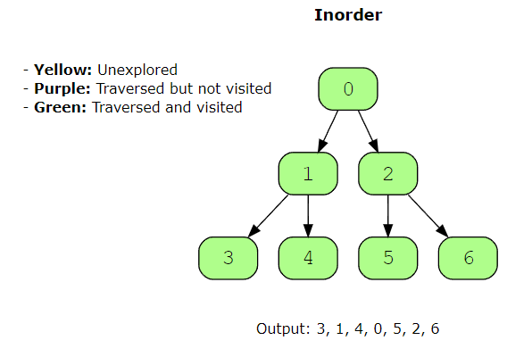
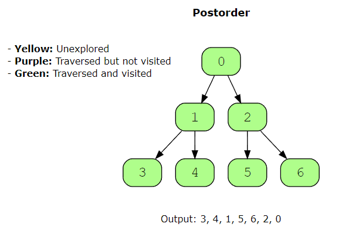

# Tree Depth First Search

Tree is a graph that contains the following properties:

- it is undirected
- it is acyclic
- it is a connected graph where any 2 vertices are connected by exactly 1 path

**Tree Depth First Search** - is a method to reduce the use of nested loops in our tree related problems
- usually implemented recursively
- done iteratively using a stack
- characteristic is that it travels as far as possible along each tree branch before exploring another

Three main methods to solving problem with depth first search pattern - Preorder, Inorder, Postorder

Preorder Traversal
- Visit the root node
- recursively perform preorder traversal on left child
- recursively perform preorder traversal on right child

Inorder Traversal (usually used when we have to find elements smaller that root)
- Recursively perform inorder traversal on left child
- visit the node
- Recursively perform inorder traversal on the right side

Postorder Traversal
- Recursively perform postorder traversal on left child
- Recursively perform postorder traversal on right child
- visit the node

## Does my problem match this pattern

Yes if:
- we have reason to believe the solution is near leaves of tree
- components of solution are listed along paths from root to leaves and finding optiomal solution requires traversal along paths (ex. find height of tree)

No if:
- input data is not in form of tree or cost of transforming to tree is too high
- solution requires traversing 1 level at a time

### Real-world problems
- Finding products in a price range
- finding routes (ex. maps for finding route between start and destination point)
- solving mazes
